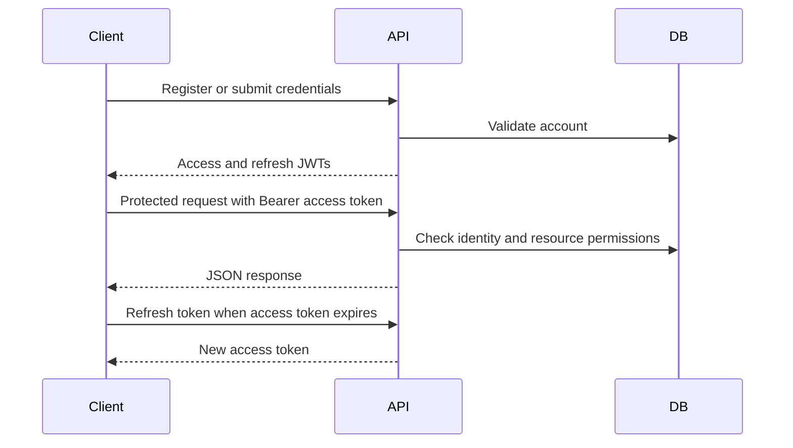
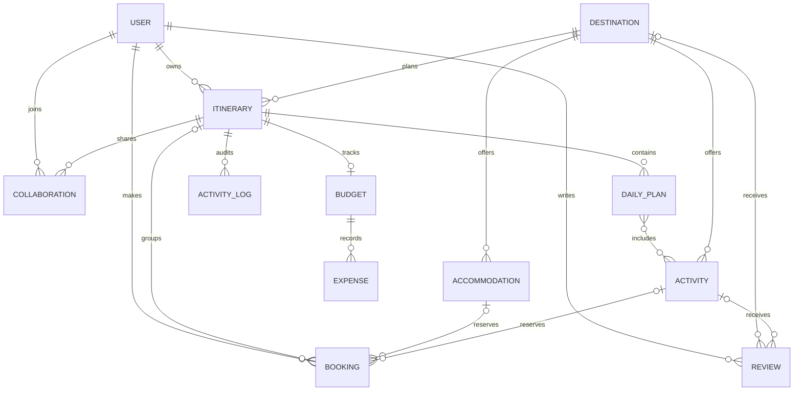

# Django Travel API

A versioned Django REST Framework API for travel destinations, trip itineraries, collaboration, bookings, reviews, budgets, and expenses. OpenAPI is available at `/api/schema/`; interactive Swagger UI is at `/api/docs/` and ReDoc at `/api/redoc/`.

## Technology and structure

Built with Django, Django REST Framework, SimpleJWT, django-filter, drf-spectacular, python-decouple, Pillow, and SQLite by default. The six domain apps are `accounts`, `destinations`, `itineraries`, `bookings`, `reviews`, and `budgets`; `travel_api` contains project settings, routing, pagination, upload validators, and exception handling.

## Setup

Use Python 3.12 or newer. In PowerShell:

```powershell
py -m venv venv
.\venv\Scripts\Activate.ps1
python -m pip install -r requirements.txt
Copy-Item .env.example .env
python manage.py migrate
python manage.py createsuperuser
python manage.py runserver
```

Set `SECRET_KEY`, `DEBUG`, and `ALLOWED_HOSTS` in `.env` before deployment. Keep `.env` private. The default database is SQLite; production should use a managed database and `DEBUG=False`.

## Authentication

Register at `POST /api/v1/accounts/register/`, then obtain access and refresh tokens at `POST /api/v1/accounts/token/`. Send `Authorization: Bearer <access-token>` on protected requests. Refresh with `POST /api/v1/accounts/token/refresh/`. Account routes also provide profile, password change, and password-reset request/confirmation. Access tokens expire; refresh tokens are rotated according to settings.



## Main endpoints

| Resource | Routes |
| --- | --- |
| Accounts | `/api/v1/accounts/register/`, `/token/`, `/token/refresh/`, `/profile/`, `/password/change/`, `/password/reset/`, `/password/reset/confirm/` |
| Itineraries | `/api/v1/itineraries/` (list/create and detail), `/search/`, `/collaborations/<trip_id>/`, `/reports/<trip_id>/`, `/<trip_id>/upload-pdf/` |
| Destinations | `/api/v1/destinations/`, `/search/`, `/recommendations/` (authenticated), `/<id>/photo/` |
| Bookings | `/api/v1/bookings/`, `/<id>/confirm/`, `/<id>/cancel/`; `/api/v1/bookings/detail/<id>/` |
| Reviews | `/api/v1/reviews/` |
| Budgets and expenses | `/api/v1/budgets/`, `/api/v1/expenses/` |
| Analytics | `/api/v1/analytics/` |

List endpoints support their documented filters, search, ordering, and pagination. Review reads and destination reads are public; account and personal booking data require authentication. Trip owners and editors can change a trip; viewers can read it. Budget and expense access follows trip collaboration roles. Only staff can upload destination photos; itinerary PDF upload requires trip edit permission.

## Example

Register and log in with cURL, then use the access token for protected routes:

```bash
curl -X POST http://127.0.0.1:8000/api/v1/accounts/register/ \
  -H 'Content-Type: application/json' \
  -d '{"username":"traveler","email":"traveler@example.com","password":"StrongPass123!"}'

curl -X POST http://127.0.0.1:8000/api/v1/accounts/token/ \
  -H 'Content-Type: application/json' \
  -d '{"identifier":"traveler","password":"StrongPass123!"}'

curl 'http://127.0.0.1:8000/api/v1/destinations/recommendations/?limit=5' \
  -H 'Authorization: Bearer <access-token>'
```

## Tests

Run `python -m pytest --cov=. --cov-report=term-missing`. Django configuration can be checked with `python manage.py check`; validate the schema with `python manage.py spectacular --validate --file schema.yml`.

## Data model




